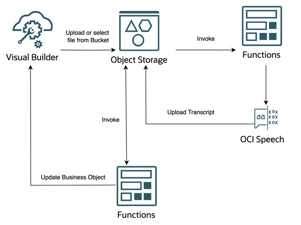

### Architecture Diagram

### Deploy 3 Functions in OCI

- [How to get started with functions](https://docs.oracle.com/en-us/iaas/Content/Functions/Tasks/functionscreatingapps.htm)

### Importing VBCS app

- Upload Speech_To_Text.zip in your Visual Builder Instance and change Object Storage URL to match your tenancy and authenticate.
- Check this blog for more detail about authenticating Object Storage API in Visual Builder. [Link](https://blogs.oracle.com/vbcs/post/using-oci-api-signature-authentication-from-visual-builder)

To include a section in your GitHub README file that guides users on how to create an issue if they need help or find a bug, you can use the following template:

---

## Reporting Issues or Bugs

If you encounter any issues, bugs, or have questions while using this project, we encourage you to create an issue in our GitHub repository. This helps us improve the project and address any problems more efficiently.

### How to Create an Issue

1. **Go to the [Issues tab](https://github.com/varunyn/Speech-to-Text/issues)** in this repository.
2. **Click on the "New Issue" button**. Describe the problem briefly, including steps to reproduce it.
3. Follow Up: We'll review and respond as soon as possible.
